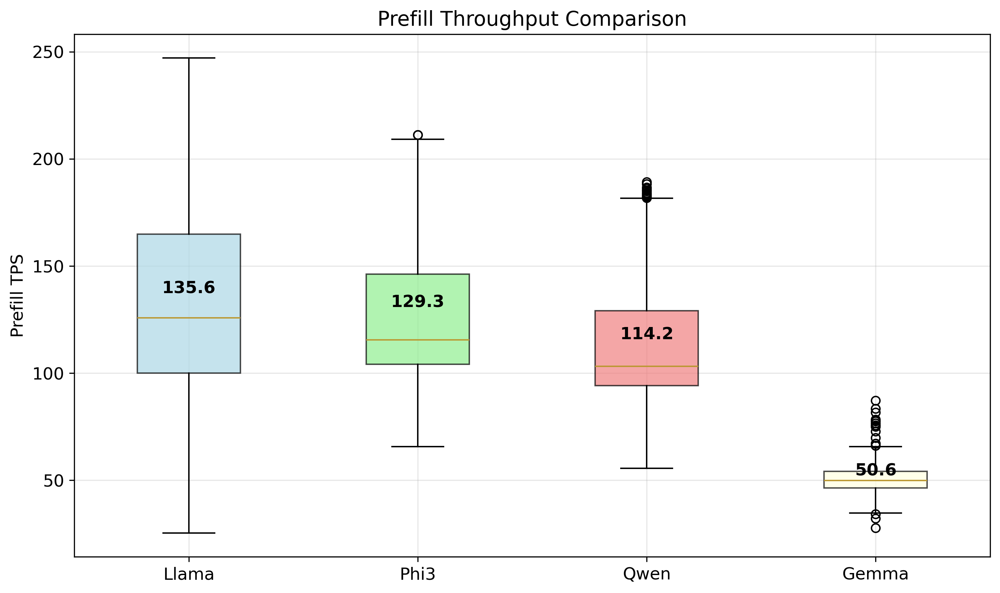
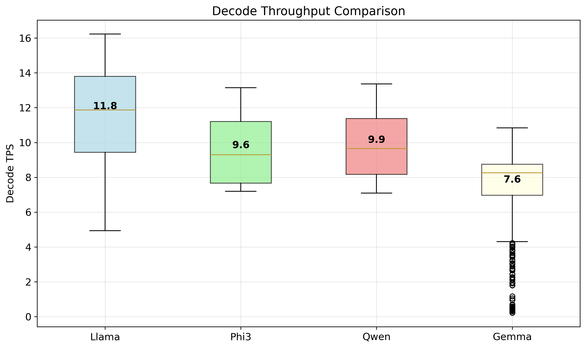
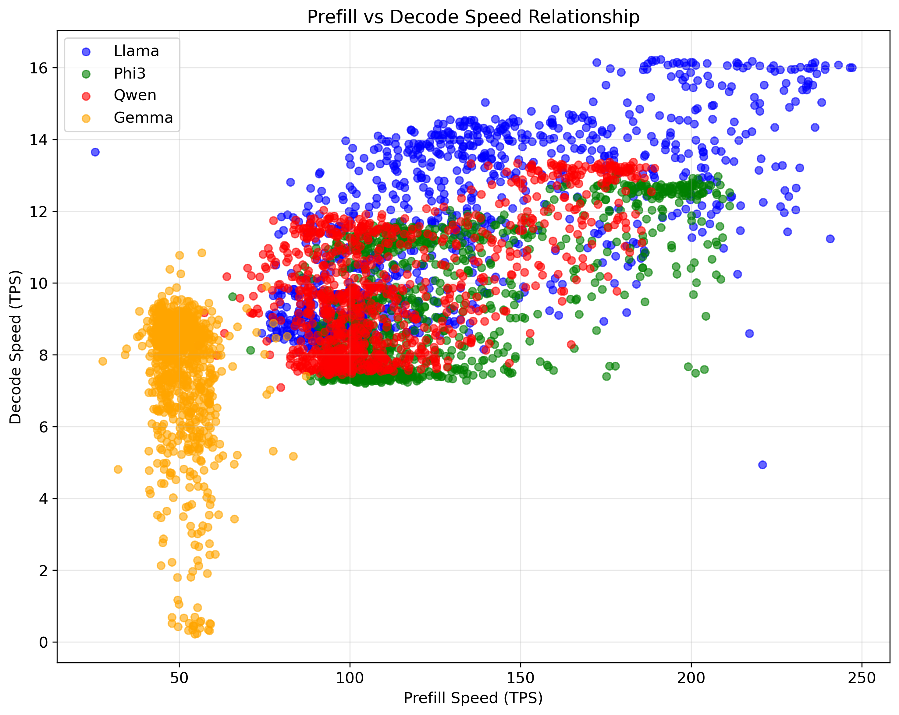
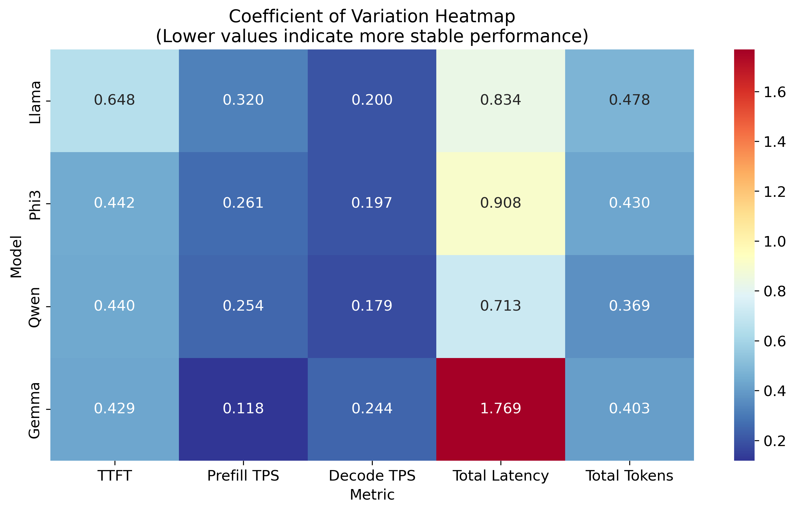
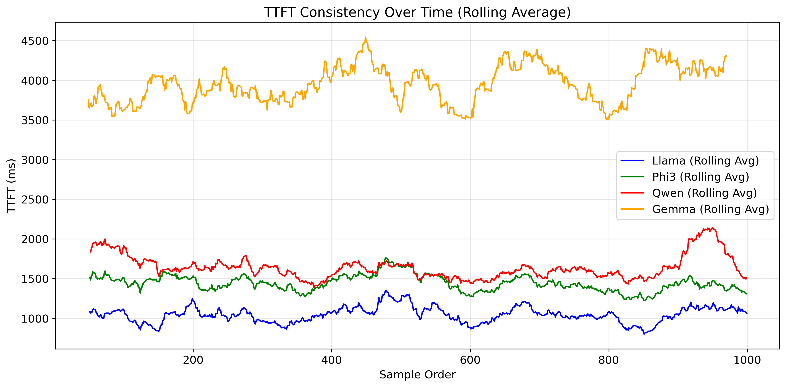

# iOS LLM Model Performance Analysis [GEMMA 3N FORTHCOMING]

This repository contains comprehensive benchmarking results for LLM models running on iOS devices. The analysis covers three language models: Llama 3.2, Phi3, and Qwen3. Each model was tested using the Instruct variant at Q4_K_M quantization level. All models were evaluated on a dataset of 1000 prompts randomly sampled from LMSys-Chat, running on iOS using the Metal backend. (WORKING ON GEMMA 3N RN)

Swift implementation available at [https://github.com/singhh5050/llama.swiftui](https://github.com/singhh5050/llama.swiftui). This runs as a submodule in the `/examples` directory of [https://github.com/ggml-org/llama.cpp](https://github.com/ggml-org/llama.cpp).

## Summary Results

### Key Performance Metrics

| Model | TTFT (ms) | Prefill TPS | Decode TPS | Total Lat (ms) | Total Tokens |
|-------|-----------|-------------|------------|----------------|--------------|
| Llama | 1046.2±678 | 135.6±43 | 11.8±2.4 | 17679±14737 | 312.9±149.4 |
| Phi3  | 1439.1±636 | 129.3±34 | 9.6±1.9 | 15852±14400 | 306.3±131.6 |
| Qwen  | 1636.8±720 | 114.2±29 | 9.9±1.8 | 19250±13717 | 343.7±126.8 |

### Key Findings

- **Best Overall Performance**: Llama 3.2 shows the best balance with fastest TTFT and highest decode throughput
- **Most Efficient Prefill**: Llama 3.2 achieves highest prefill throughput at 135.6 TPS
- **Fastest Decode**: Llama 3.2 leads in decode speed at 11.8 TPS
- **Lowest Total Latency**: Phi3 has the shortest average total latency despite slower TTFT
- **Most Verbose**: Qwen generates the most tokens on average (343.7 tokens)

## Visualizations

### Performance Comparisons

#### Time to First Token (TTFT)

*Comparison of time to first token across models with error bars showing standard deviation.*

#### Prefill Throughput

*Prefill speed performance in tokens per second with error bars.*

#### Decode Throughput

*Decode speed performance in tokens per second with error bars.*

#### Total Latency

*Overall latency comparison across models with error bars.*

#### Total Tokens

*Total token counts by model (capped at 512) with error bars.*

### Additional Analysis

#### Prefill vs Decode Speed Relationship

*Scatter plot showing the relationship between prefill and decode speeds, colored by model.*

#### Stability Analysis

*Coefficient of variation heatmap showing performance stability (lower values indicate more stable performance).*

#### Consistency Over Time

*Time to first token consistency over sample order using rolling average.*

## Model Specifications

### Llama 3.2 (3B Parameters)
- **Model Size**: 1.87 GiB
- **Quantization**: Q4_K_M
- **Backend**: Metal (iOS)
- **Performance**: Best overall throughput and lowest TTFT

### Phi3 (3.84B Parameters)
- **Model Size**: 2.31 GiB  
- **Quantization**: Q4_K_M
- **Backend**: Metal (iOS)
- **Performance**: Lowest total latency, good stability

### Qwen3 (4.02B Parameters)
- **Model Size**: 2.32 GiB
- **Quantization**: Q4_K_M
- **Backend**: Metal (iOS)
- **Performance**: Most verbose output, moderate speeds

## Repository Structure

```
├── README.md                           # This file
├── data/                              # Raw benchmark data
│   ├── llama_combined.csv
│   ├── phi3_combined.csv
│   └── qwen_combined.csv
├── figures/                           # Generated visualizations
│   ├── time_to_first_token_comparison.png
│   ├── prefill_throughput_comparison.png
│   ├── decode_throughput_comparison.png
│   ├── total_latency_comparison.png
│   ├── total_tokens_comparison.png
│   ├── prefill_vs_decode_scatter.png
│   ├── coefficient_variation_heatmap.png
│   └── ttft_consistency_over_time.png
├── results/                           # Analysis results
│   └── model_performance_summary_table.csv
├── scripts/                           # Analysis scripts
│   └── model_analysis_final.py
├── requirements.txt                   # Python dependencies
└── venv/                             # Virtual environment (excluded from git)
```

## Usage

### Prerequisites

- Python 3.8 or higher
- Virtual environment (recommended)

### Installation

1. Clone this repository:
   ```bash
   git clone <repository-url>
   cd ios-llm-benchmarking-results
   ```

2. Create and activate a virtual environment:
   ```bash
   python3 -m venv venv
   source venv/bin/activate  # On Windows: venv\Scripts\activate
   ```

3. Install dependencies:
   ```bash
   pip install -r requirements.txt
   ```

### Running the Analysis

To regenerate all visualizations and summary statistics:

```bash
python3 scripts/model_analysis_final.py
```

This will:
- Process the raw CSV data files
- Generate all visualization plots in the `figures/` directory
- Create the summary table in the `results/` directory
- Print performance statistics to the console

## Technical Details

### Benchmarking Setup

- **Platform**: iOS devices with Metal backend
- **Test Dataset**: 1000 randomly sampled prompts from LMSys-Chat
- **Quantization**: Q4_K_M for all models (optimal balance of size vs quality)
- **Token Limit**: Capped at 512 tokens per generation
- **Implementation**: Based on llama.cpp with Swift UI wrapper

### Metrics Explained

- **TTFT (Time to First Token)**: Latency from prompt input to first generated token
- **Prefill TPS**: Throughput during prompt processing phase (tokens/second)
- **Decode TPS**: Throughput during token generation phase (tokens/second)
- **Total Latency**: End-to-end time for complete response generation
- **Total Tokens**: Number of tokens in the generated response

### Data Processing

- Raw data includes comment headers with metadata
- Numeric columns are validated and cleaned
- Token counts are capped at 512 for consistency
- Statistical analysis includes mean ± standard deviation
- Coefficient of variation used for stability analysis

## Performance Insights

### iOS-Specific Considerations

Running LLMs on iOS presents unique challenges and opportunities:

- **Metal Backend**: Leverages Apple's GPU compute framework for acceleration
- **Memory Constraints**: Mobile devices have limited RAM affecting model size choices
- **Thermal Management**: Sustained inference may trigger thermal throttling
- **Power Efficiency**: Battery life considerations influence performance profiles

### Model Comparison Summary

1. **Llama 3.2** emerges as the most balanced choice for iOS deployment:
   - Fastest time to first token (1046ms average)
   - Highest decode throughput (11.8 TPS)
   - Smallest model size (1.87 GiB)
   - Good performance consistency

2. **Phi3** offers the lowest total latency despite slower TTFT:
   - Compact responses with good quality
   - Stable performance characteristics
   - Moderate resource requirements

3. **Qwen3** generates the most comprehensive responses:
   - Highest token output (343.7 average)
   - Slower but consistent performance
   - Largest model with most parameters

## Related Work

This analysis complements similar benchmarking efforts:

- [macOS LLM Benchmarking Results](https://github.com/singhh5050/macos-llm-benchmarking-results) - Desktop performance comparison
- [llama.cpp](https://github.com/ggml-org/llama.cpp) - Core inference engine
- [Swift UI Implementation](https://github.com/singhh5050/llama.swiftui) - iOS application wrapper
